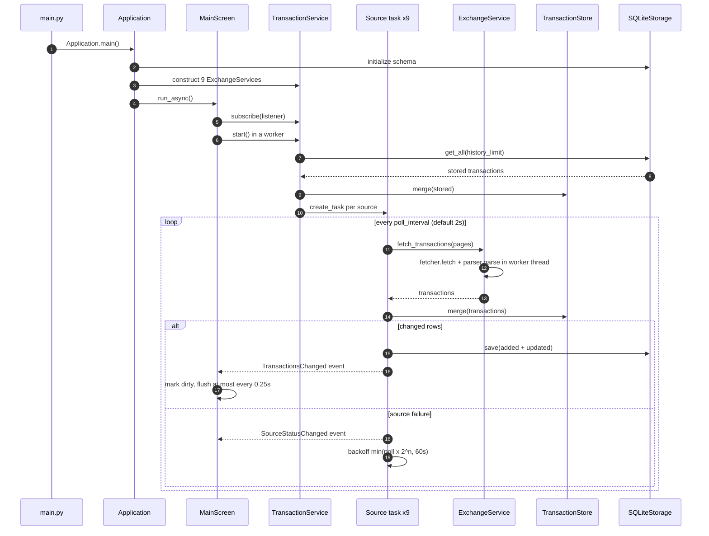
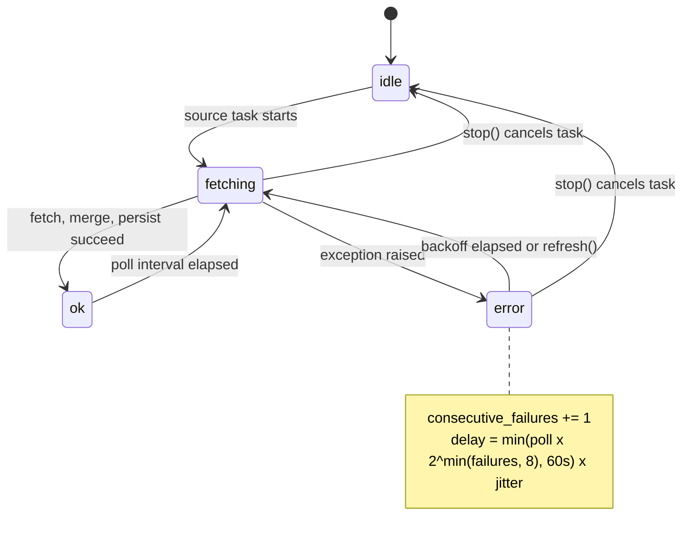
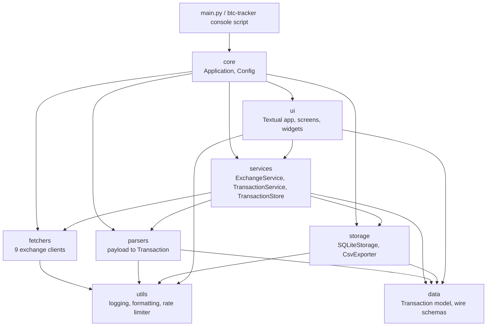
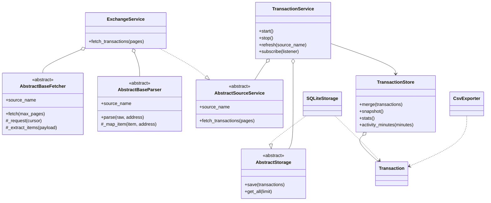
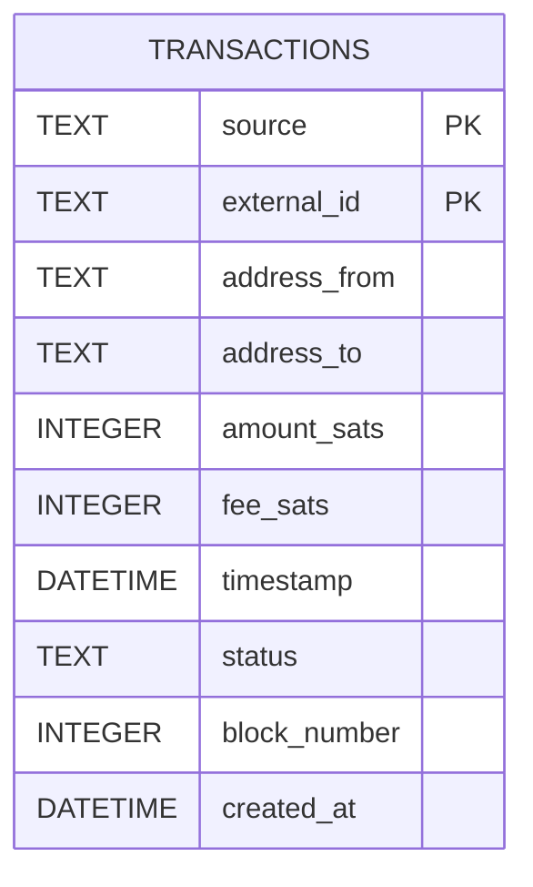

<h1 align="center">BTC Transaction Tracker</h1>

<p align="center">
  <strong>A terminal application that aggregates buy/sell Bitcoin market trades from<br/>
  major crypto exchanges into one sortable, filterable TUI.</strong>
</p>

<p align="center">
  <a href="https://www.python.org/downloads/"></a>
  <a href="https://textual.textualize.io/"></a>
  <a href="https://docs.aiohttp.org/"></a>
  <a href="https://www.sqlite.org/"></a>
  <a href="https://docs.pytest.org/"></a>
  <a href="LICENSE"></a>
</p>

<p align="center">
  Built in Python 3.14+ following the OOP-first architecture.
</p>

<p align="center">
  <a href="#setup">Setup</a> ·
  <a href="#running">Running</a> ·
  <a href="#keybindings">Keybindings</a> ·
  <a href="#real-time-behavior">Real-Time Behavior</a> ·
  <a href="#architecture">Architecture</a> ·
  <a href="#configuration">Configuration</a> ·
  <a href="#testing">Testing</a>
</p>

## Phase 1 Status

| Layer | Implemented |
|---|---|
| Exchanges | Public buy/sell market trades from Binance, Coinbase Exchange, Kraken, Bybit, OKX, KuCoin, Bitget, MEXC, Gemini |
| Storage | SQLite with integer-satoshi amounts, `(source, external_id)` primary key, indexes, chunked upserts, incremental live writes, CSV export |
| Services | Real-time per-source feed loops, per-source failure isolation with backoff, in-memory deduplicating store, health reporting |
| TUI | Live event-driven table, buy/sell totals, activity sparkline, per-source health, source filters, detail view, help screen, CSV export, responsive layout |

## Requirements

- Python 3.14 or newer
- A terminal with true-color support (recommended)

## Setup

Windows quick start:

```bat
:: create .venv and install runtime dependencies
install.bat

:: also install the test tooling
install.bat dev

:: start the app; arguments are forwarded
launch.bat
```

Manual setup (any OS):

```bash
python -m venv .venv

# Windows
.venv\Scripts\activate
# macOS / Linux
source .venv/bin/activate

python -m pip install -e ".[dev]"
```

No API keys are required: exchange fetchers read public market-data
endpoints. Copy `.env.example` to `.env` only if you want to override the
application defaults.

## Running

```bat
launch.bat
launch.bat --log-level DEBUG
```

Or run the Python entrypoint directly:

```bash
python main.py
python main.py --log-level DEBUG
```

After installation the console script is also available:

```bash
btc-tracker
```

## Keybindings

| Key | Action |
|---|---|
| `q` | Quit |
| `r` | Fetch immediately from all exchanges |
| `s` | Focus the trade search bar |
| `f` | Focus the source filter |
| `t` | Focus the trade table |
| `Tab` | Cycle the source filter |
| `Enter` | Open the selected trade's details |
| `e` | Export the current filtered view to CSV |
| `h` | Help screen |
| `Escape` | Blur the search bar / return from a detail or help screen |

Single-key shortcuts apply when the search bar is not focused; press
`Escape` to blur it.

## Real-Time Behavior

Trades stream in automatically; no manual refresh is required.



- Every source runs its own async feed loop. Loops fetch concurrently, merge
  new trades into an in-memory store, and persist only new or changed rows.
- The TUI subscribes to feed events and applies updates incrementally: new
  rows are appended and re-sorted, cells are patched in place, and the table,
  totals, activity chart, and per-source health all update together.
- Rendering is throttled to at most one flush per `UI_FLUSH_INTERVAL_SECONDS`
  (default 0.25s) so bursts of trades cannot flood the UI, and search input
  is debounced.
- A failing source is isolated: it backs off exponentially, its health is
  shown as `error`, and the remaining sources keep streaming. Press `r` to
  retry immediately.
- The table renders at most `RENDER_LIMIT` rows (newest first) while totals
  cover every loaded trade; the live store keeps at most
  `MAX_TRANSACTIONS` entities in memory. SQLite retains the full history.

### Source health states



Each source owns an `asyncio.Event` wakeup handle, so `refresh()` (the `r`
key) skips the remaining backoff and fetches immediately.

## Architecture

### System overview

```mermaid
flowchart LR
    subgraph EXCH["Exchange REST APIs (public market data)"]
        direction TB
        BIN["Binance"]
        CB["Coinbase Exchange"]
        KRK["Kraken"]
        BYB["Bybit"]
        OKX["OKX"]
        KC["KuCoin"]
        BG["Bitget"]
        MXC["MEXC"]
        GEM["Gemini"]
    end

    subgraph FETCH["btc_tracker.fetchers"]
        BF["AbstractBaseFetcher<br/>pagination / retries / RateLimiter"]
    end

    subgraph PARSE["btc_tracker.parsers"]
        BP["AbstractBaseParser<br/>pydantic validation / satoshi mapping"]
    end

    subgraph SVC["btc_tracker.services"]
        ES["ExchangeService<br/>one per source"]
        TS["TransactionService<br/>feed loops / events / health"]
        STORE["TransactionStore<br/>dedup / stats / activity"]
    end

    subgraph STOR["btc_tracker.storage"]
        SQL["SQLiteStorage<br/>chunked upserts"]
        CSV["CsvExporter"]
    end

    subgraph UIL["btc_tracker.ui"]
        MS["MainScreen<br/>throttled incremental flush"]
    end

    EXCH --> BF --> ES
    ES --> BP --> TS
    TS --> STORE
    TS -->|"new / changed rows"| SQL
    TS -->|"events + snapshots"| MS
    MS -->|"export filtered view"| CSV
```



### Module map

```text
btc_tracker/
├── core/        Application orchestrator + pydantic-settings configuration
├── data/        Transaction domain model + boundary validation schemas
├── fetchers/    Abstract fetcher lifecycle + per-source I/O
├── parsers/     Raw payload -> Transaction mapping
├── storage/     Abstract storage, SQLite backend, CSV export
├── services/    Source services, real-time feed, in-memory transaction store
├── ui/          Textual app, screens, widgets, styles
└── utils/       Logging, formatting, rate limiter
```

Dependency direction (arrows point at imported packages):



### Data flow

```text
Fetcher ──▶ Parser ──▶ TransactionService feed ──▶ TransactionStore ──▶ TUI events
                            │
                            └──▶ SQLiteStorage   (new / changed rows only)
```

### Core abstractions



### Exchange sources

Nine `AbstractBaseFetcher`/`AbstractBaseParser` pairs are wired in
`Application.EXCHANGE_SOURCES` (`btc_tracker/core/app.py`):

| Source | Base URL | Endpoint | Pair | Rate limit (req/window) |
|---|---|---|---|---|
| `binance` | `https://api.binance.com` | `/api/v3/aggTrades` | `BTCUSDT` | 20 / 1.0s |
| `coinbase` | `https://api.exchange.coinbase.com` | `/products/{product_id}/trades` | `BTC-USD` | 10 / 1.0s |
| `kraken` | `https://api.kraken.com` | `/0/public/Trades` | `XBTUSD` | 10 / 1.0s |
| `bybit` | `https://api.bybit.com` | `/v5/market/recent-trade` | `BTCUSDT` | 10 / 1.0s |
| `okx` | `https://www.okx.com` | `/api/v5/market/trades` | `BTC-USDT` | 10 / 2.0s |
| `kucoin` | `https://api.kucoin.com` | `/api/v1/market/histories` | `BTC-USDT` | 10 / 1.0s |
| `bitget` | `https://api.bitget.com` | `/api/v2/spot/market/fills` | `BTCUSDT` | 10 / 1.0s |
| `mexc` | `https://api.mexc.com` | `/api/v3/trades` | `BTCUSDT` | 20 / 1.0s |
| `gemini` | `https://api.gemini.com` | `/v1/trades/{symbol}` | `btcusd` | 5 / 1.0s |

All requests share one async sliding-window `RateLimiter`; per-request
timeouts, retries, and `429`/`5xx` handling live in `AbstractBaseFetcher`.

### Storage schema



- Composite primary key `(source, external_id)` deduplicates trades per
  exchange; upserts only rewrite new or changed rows.
- Secondary indexes: `idx_address_from`, `idx_address_to`, `idx_timestamp`,
  `idx_source`.
- Writes are batched (500 rows), serialized by an `asyncio.Lock`, and run off
  the event loop; `journal_mode=WAL` and `synchronous=NORMAL`.
- Amounts are stored as integer satoshis. CSV export adds a derived
  `amount_btc` column alongside the raw fields.

### TUI layout

```text
┌─ Header (title + clock) ──────────────────────────────────────────────────┐
│ TradeSearchBar                       │ SourceFilterTabs                   │
├──────────────────────────────────────┼────────────────────────────────────┤
│ TransactionTable                     │ StatsPanel (buy/sell/net/volume)   │
│  ID │ Amount (BTC) │ Fee │ Time │ …  │ ActivityPanel (30-min sparkline)   │
│                                      │ SourceHealthPanel (per source)     │
├──────────────────────────────────────┴────────────────────────────────────┤
│ SummaryPanel (totals + activity)                                          │
├───────────────────────────────────────────────────────────────────────────┤
│ StatusBar (store version, counts)                                         │
├───────────────────────────────────────────────────────────────────────────┤
│ Footer (key hints)                                                        │
└───────────────────────────────────────────────────────────────────────────┘
```

The sidebar is hidden below 120 columns and the table switches between
`full`, `medium`, and `narrow` column profiles as the terminal resizes.

### Key design rules

- Amounts are **integer satoshis** end to end; no floats touch financial data.
- Fetchers own I/O, parsers own mapping, services compose the pair.
- Parsing runs in a worker thread: CPU-bound mapping never blocks the event
  loop that drives the TUI.
- Exchange fetchers are market-scoped and never receive a wallet address.
- Exchanges expose **public buy/sell market trades only** (recent BTC pairs,
  no account data). A positive amount is a buy, a negative amount is a sell.
- All network calls are async (`aiohttp`) and paced by an async sliding-window
  `RateLimiter` with exponential backoff and retry.
- The feed and the UI are decoupled by events: the UI never polls for data.
- A failing source is logged, isolated, and retried; other sources continue.

## Configuration

All settings are read from environment variables or `.env`
(see [`.env.example`](.env.example)):

| Variable | Default | Purpose |
|---|---|---|
| `DATABASE_PATH` | `btc_tracker.db` | SQLite database file |
| `LOG_LEVEL` | `INFO` | Logging level |
| `HTTP_TIMEOUT_SECONDS` | `30` | Per-request timeout |
| `MAX_RETRIES` | `3` | Attempts per HTTP request |
| `DEFAULT_RATE_LIMIT_REQUESTS` | `10` | Requests allowed per rate-limit window |
| `DEFAULT_RATE_LIMIT_WINDOW_SECONDS` | `1.0` | Rate-limit window length in seconds |
| `POLL_INTERVAL_SECONDS` | `2.0` | Seconds between live polls of each source |
| `BACKFILL_PAGES` | `3` | Pages fetched per source on its first feed pass |
| `POLL_PAGES` | `1` | Pages fetched per source on later live polls |
| `HISTORY_LIMIT` | `50000` | Stored rows hydrated into the feed at startup |
| `MAX_TRANSACTIONS` | `50000` | Maximum entities kept in the live in-memory store |
| `RENDER_LIMIT` | `1000` | Maximum rows rendered in the trade table |
| `UI_FLUSH_INTERVAL_SECONDS` | `0.25` | Minimum seconds between UI data flushes |
| `SEARCH_DEBOUNCE_SECONDS` | `0.15` | Debounce applied to search input changes |

## Testing

```bash
python -m pytest
```

The suite covers the transaction store, the real-time feed (incremental
persistence, failure isolation and recovery, event delivery), SQLite storage,
formatting, headless Textual screens (real-time updates, filtering, sorting,
cursor retention, resize profiles, export), performance guardrails, and
bounded high-volume stress runs.

## Notes

- `pandas` is a declared dependency but is imported lazily for batch
  transformations only; startup never loads it.
- `sqlite3` is Python stdlib and intentionally not declared as a dependency.
- Test tooling lives in the `dev` extra so runtime installs stay lean.
